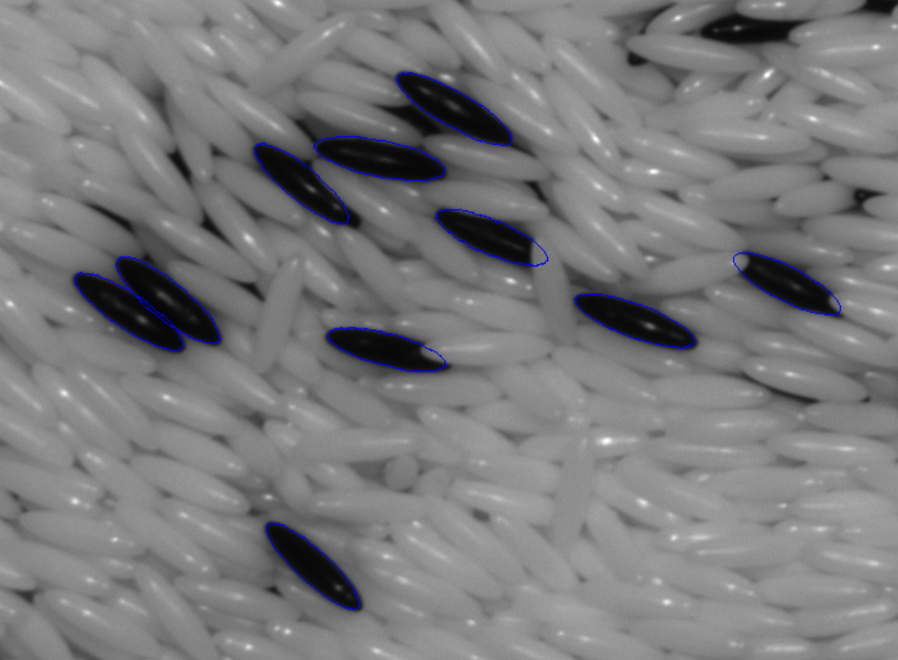
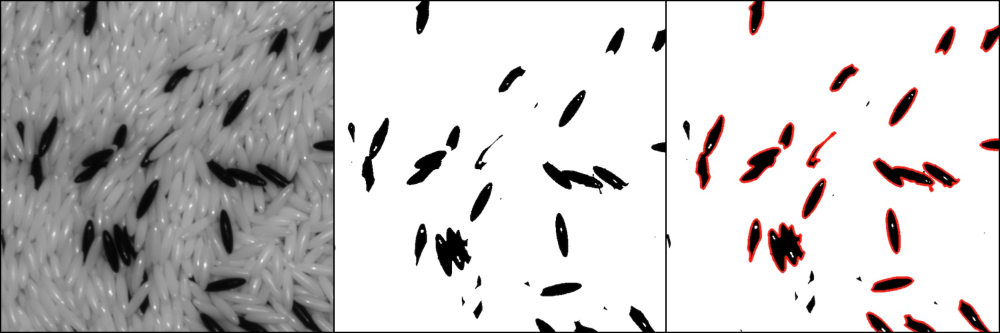

# Robust ellipse detection written in Rust

This program implements the RANSAC based robust ellipse fitting algorithm described by [W Kaewapichai, P Kaewtrakulpong (2008)](https://scholar.google.com/scholar?cluster=5586026904313573649&hl=en&as_sdt=2007). This implementation is written purely in Rust. It is capable of detecting ellipse shaped blobs where the ellipse is partially occluded or more of them are clustered together into a single blob.



## Example usage

Building is simple using `cargo`:

```shell
cargo build --release
```

For a short description of the available command line options, run:

```shell
./target/release/ellipse_detect -h
```

In the `example_use` directory, an example configuration file is provided `config.yaml`, along with a sample image `img.bmp`. We can run the program with the following command:

```shell
./target/release/ellipse_detect -c example_use/config.yaml -f example_use/img.bmp --outimg example_use/out.png --outfile example_use/out.json
```

Which results in a JSON file `out.json` and an image `out.png` containing and showing the detected ellipses. Both output files are optional. The output image is just a visualization of the detected ellipses, we usually do not need it, but it is useful for viusally assessing the quality of the detection. The output JSON file contains a list of detected ellipses, each ellipse is represented by a dictionary with the following keys:

```json
{
    "a": 47.99351164808638,
    "b": 11.796194030129517,
    "x": 1063.9748000216746,
    "y": 141.3909574884799,
    "theta": -0.3875775553444095
}
```

Where `a` and `b` are the major and minor axis lengths, `x` and `y` are the center of the ellipse, and `theta` is the orientation of the ellipse in radians.

The accepted input and output image formats are `png`, `bmp` and `jpg`.

## Configuration file

In the provided example configuration file `example_use/config.yaml`, we can set input parameters affecting the detection algorithm.

- The first couple of parameters are regarding the binarization of the image and the RANSAC algorithm. To be able to understand these parameters, take a look at the next section, where we briefly describe the implemented algorithm.
- With the other parameters, we can set filters for throwing away unwanted ellipses and contours, making the output cleaner and more precise. These parameters are explained in the comments of the `config.yaml` file.

A configuration file can be specified with the `-c path/to/config.yaml` required command line option.

## Description of the algorithm

In the following section, we give a brief description of the implemented algorithm:

> Kaewapichai, W. and Kaewtrakulpong, P., 2008. Robust ellipse detection by fitting randomly selected edge patches. World Academy of Science, Engineering, and Technology, 48, pp.30-33.

### Binarization and contour detection

The image is first binarized using a threshold, specified in the config file, then the contours are detected on the edges of the blobs in the binarized image. An example of this procedure is shown in the figure below.



On the left side of the figure, the original image is shown. In the middle, we can see the binarized image and on the left, the contours around the binarized blobs are shown in red. The contours are a list of pixel coordinates on the border of the black blobs. We can see that the smaller contours are not highlighted in red, because they are excluded by a filter set in the config file.

### RANSAC and ellipse fitting

Now we can apply the RANSAC algorithm to the detected contours. The algorithm is implemented in the `robust_fit.rs` file. The detailed description of the method can be found in the cited paper, here we only give a short overview.

At first, we take a number of random samples of the points in the contour. A sample is taken using the following method: We take a pair of random points independently on the contour, and if their distance is larger than the `2 * radius_threshold` (see config file), then we discard the pair, otherwise we keep the pair. If we keep the pair, then we append them to the sample along with the contour points that are closer to them than the `radius_threshold`. We repeat this step until we find `3` eligible pairs. (Our sample taking method slightly differs from the one described in the paper.)

The number of samples taken is by default a couple of hundred, but we can set the sample multiplier to take more samples. This can be done using the `--samplemult` CLI option, the default value is `10`. If we set it higher, the quality of the output will be better, but the computation time will increase as well.

After getting the samples, we fit an ellipse onto each of them using the [direct least square method by A. Fitzgibbon, M. Pilu and R.B. Fisher](https://ieeexplore.ieee.org/document/765658). This algorithm is implemented in the `fit_ellipse.rs` file.

For each fitted ellipse, we calculate its __fitness__ score with the following formula:

$$
\text{fitness} = \frac{N}{\text{perimeter of ellipse}}
$$

Where $N$ is the number of points in the contour with distance from the ellipse perimeter smaller than `dist_threshold` and $\text{perimeter of ellipse}$ of course means the perimeter of the fitted ellipse, in pixel units.

The fitted ellipses are then sorted by their fitness score and the ellipse with the highest fitness score is the one that is chosen as the best fit. If none of the ellipses have a fitness higher than the `min_fitness` specified in the config file, then the algorithm terminates and no ellipses are found. Otherwise, if the best ellipse is eligible, then we save it and remove the contour points from the point set that are closer to the ellipse than the `dist_threshold`.

Then we take random samples again and repeat this procedure until there are no more eligible ellipses left.
